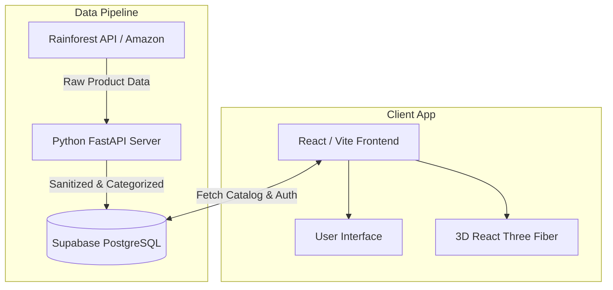

<div align="center">
  
  <h1>🚀 Revamp: Intelligent Full-Stack PC Builder</h1>
  <p><strong>Powered by Live Amazon Data & Intelligent Curation</strong></p>

  [](https://revamp-ai-gamma.vercel.app)
  [](https://reactjs.org/)
  [](https://fastapi.tiangolo.com/)
  [](https://supabase.com/)
  [](https://rainforestapi.com/)
</div>

<br />

Revamp is a professional, high-performance PC building platform designed to eliminate the guesswork of buying PC components. By integrating **live Amazon product data via the Rainforest API**, it ensures that every hardware recommendation is real, accurately priced, and currently available.

Built with technical depth and scalability in mind, this project demonstrates a modern full-stack architecture with Python microservices, real-time data synchronization, and secure Row-Level Security (RLS).

---

## ✨ Key Features

### 🛒 Live Amazon Data Integration (Rainforest API)
- **Automated Python Backend**: A robust FastAPI microservice that fetches real-time PC components, pricing, and metadata directly from Amazon using the **Rainforest API**.
- **Categorization Engine**: Automatically sorts raw API data into strict hardware categories (CPU, GPU, Motherboard, etc.) and pushes them to the Supabase database.
- **Dynamic Pricing**: PC build configurations reflect actual market prices, giving users a realistic budgeting experience.

### 🛡️ Secure Access & Data Isolation
- **Row Level Security (RLS)** implemented deeply within PostgreSQL.
- Sellers securely manage their own inventory, while Customers have strict, private access to their saved hardware builds.

### 💻 Hardware Logic & Optimization
- **Intelligent Build Engine**: Filters the live Amazon database against the user's budget and desired purpose (Gaming, Video Editing, etc.) to curate the optimal build.
- **Compatibility Checks**: Validates configurations to ensure components fit together.
- **3D Visualization**: Interactive 3D PC modeling powered by React Three Fiber, optimized for mobile performance.

---

## 🛠️ Technical Stack

### **Frontend Client**
- **Framework:** React 18, Vite, TypeScript
- **Styling:** Tailwind CSS, shadcn/ui, Framer Motion
- **State Management:** Zustand
- **3D Rendering:** Three.js / React Three Fiber

### **Backend & APIs**
- **Microservice:** Python, FastAPI (for data pipelines)
- **External Data Source:** Rainforest API (Amazon Data)
- **Database & Auth:** Supabase (PostgreSQL)

---

## 🏗️ Architecture



---

## 🚀 Getting Started

### Prerequisites
- Node.js (v18+)
- Python 3.10+
- A Supabase Project
- A Rainforest API Key

### Installation

1. **Clone the repository:**
   ```bash
   git clone https://github.com/SharveshKandavel/Revamp-AI.git
   cd Revamp-AI
   ```

2. **Install Frontend Dependencies:**
   ```bash
   npm install
   ```

3. **Install Backend Dependencies:**
   ```bash
   pip install -r requirements.txt
   ```

4. **Environment Configuration:**
   Create a `.env` file in the root directory:
   ```env
   # Frontend
   VITE_API_URL=http://localhost:8000
   VITE_SUPABASE_URL=your_supabase_url
   VITE_SUPABASE_ANON_KEY=your_supabase_anon_key

   # Backend Data Pipeline
   SUPABASE_SERVICE_ROLE_KEY=your_service_role_key
   RAINFOREST_API_KEY=your_rainforest_api_key
   ```

5. **Run the Application:**
   *Start the Python Data API:*
   ```bash
   cd api
   uvicorn index:app --reload --port 8000
   ```
   *Start the React Frontend (in a new terminal):*
   ```bash
   npm run dev
   ```

---

## 🕹️ Quick Demo Access

To explore the application without creating an account, you can use these test credentials on the live deployment:

| Role | Email | Password |
| :--- | :--- | :--- |
| **Customer** | `test@customer.com` | `password123` |
| **Seller** | `test@seller.com` | `password123` |

---

## 💼 Co-op Portfolio Context
*This project was developed to demonstrate proficiency in full-stack engineering, API integration, and secure database design. It solves the real-world problem of providing custom PC buyers with elite curation tools backed by live, real-world market data.*

<p align="center">
  <b>Developed with 💻 and ☕ by Sharvesh Kandavel</b>
</p>
