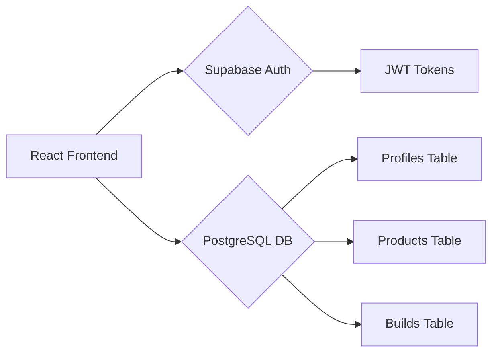

# 🚀 Revamp: Professional Full-Stack PC Builder

[](https://revamp-ai-gamma.vercel.app)
[](https://reactjs.org/)
[](https://supabase.com/)
[](https://www.postgresql.org/)

Revamp is a professional, high-performance PC building platform.

Built with technical depth and scalability in mind, this project demonstrates a modern full-stack architecture with real-time data synchronization and secure access.

---

## 🛠️ Technical Stack

- **Frontend**: React 18, Vite, TypeScript, Tailwind CSS, shadcn/ui.
- **State Management**: React Context API with persistent user sessions.
- **Backend-as-a-Service**: Supabase (Authentication & PostgreSQL Database).
- **Visualization**: Three.js (React Three Fiber) for interactive 3D PC modeling.
- **Deployment**: Vercel (CI/CD connected to GitHub).

---

## 🕹️ Quick Demo Access

To explore the application without creating an account, use these test credentials:

| Role | Email | Password |
| :--- | :--- | :--- |
| **Customer** | `test@customer.com` | `password123` |
| **Seller** | `test@seller.com` | `password123` |

---

## 🌟 Key Technical Features

### 1. Secure Access Control
- Implemented **Row Level Security (RLS)** in PostgreSQL to ensure strict data isolation. 
- Sellers can only manage their own inventory, while Customers have private access to their saved builds.

### 2. Real-Time Cloud Persistence
- Successfully migrated from static prototypes to a dynamic backend.
- Managed complex JSONB structures for storing PC configurations, allowing for flexible component metadata.

### 3. Professional Dashboards
- **Seller Inventory**: Full CRUD operations with instant UI feedback and database synchronization.

### 4. Hardware Logic & Optimization
- Developed a **Power Consumption Calculator** and **Compatibility Engine** to validate hardware configurations against technical constraints.
- Optimized 3D rendering performance for mobile devices using React Three Fiber.

---

## 📐 Architecture



---

## 🚀 Getting Started

### Prerequisites
- Node.js (v18+)
- A Supabase Project

### Installation
1. Clone the repository: `git clone https://github.com/SharveshKandavel/Revamp-AI.git`
2. Install dependencies: `npm install`
3. Configure Environment Variables:
   Create a `.env` file with:
   ```env
   VITE_SUPABASE_URL=your_url
   VITE_SUPABASE_ANON_KEY=your_key
   ```
4. Run locally: `npm run dev`

---

## 💼 Co-op Portfolio Context
*This project was developed to demonstrate proficiency in full-stack engineering, secure database design, and high-performance frontend visualization. It solves the real-world problem of providing custom PC buyers with elite curation tools.*

---

**Developed with 💻 and ☕ by Sharvesh Kandavel**

